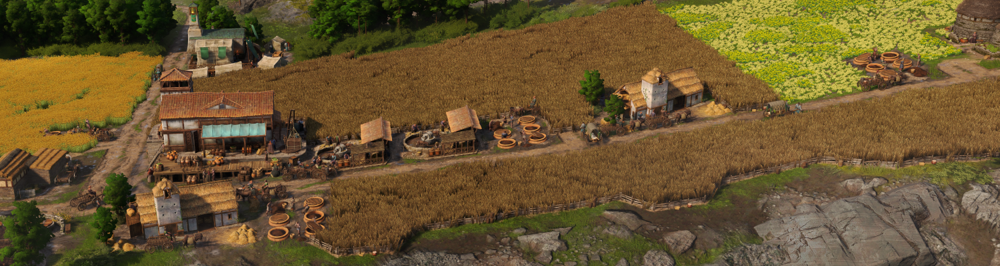
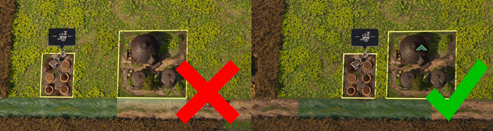

# Fertiliser

Fertiliser serves as a replacement system for aqueducts boosting farm/plantation productivity and the Ceres extra fields buff. By building a fertiliser silo near a Celtic farm and supplying it with fertiliser it boosts the farm productivity by 100%. While this isn't as strong as the Ceres fields + aqueduct 125%, it's more space efficient since a silo only adds 6 tiles instead of the 40-70 tiles the extra fields would require.

Fertiliser is output as an extra good by ochs farms but can also be produced in marshes by the fertiliser pit.

The fertiliser good, the ochs extra output buff, and fertiliser silos are unlocked at 4000 Epona devotion along with regular animal silos.

Going below 3500 Epona devotion will remove the ability to build new fertiliser silos and fertiliser pits, and disable the ochs additional output buff. Existing silos and pits will continue to function. This is the same behaviour as the base game when unlocks are lost from losing devotion.

## Important Limitation due to Bug
Currently the fertiliser silo buff is based on street distance and you need to make sure your silos are close enough to the parent building!

Once the silo bug that breaks buffs targeting only the parent building on loading a game is fixed in the base game I will patch the fertiliser silos to match.

After I have patched the mod **<u>you will need to pause and unpause all fertiliser silos to make the change take effect</u>**. You will only need to do this once and you can do this for all fertiliser silos on an island at the same time by holding shift when clicking pause.