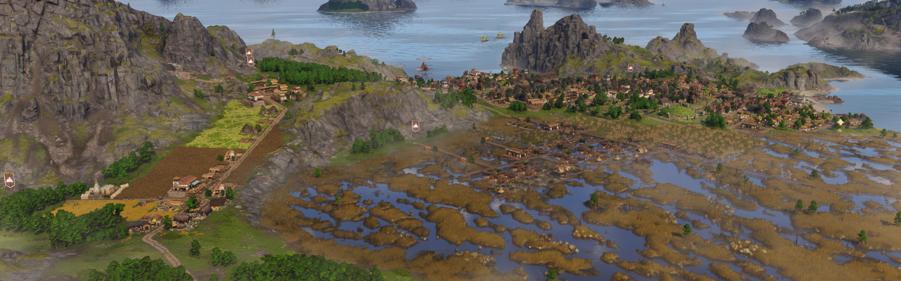
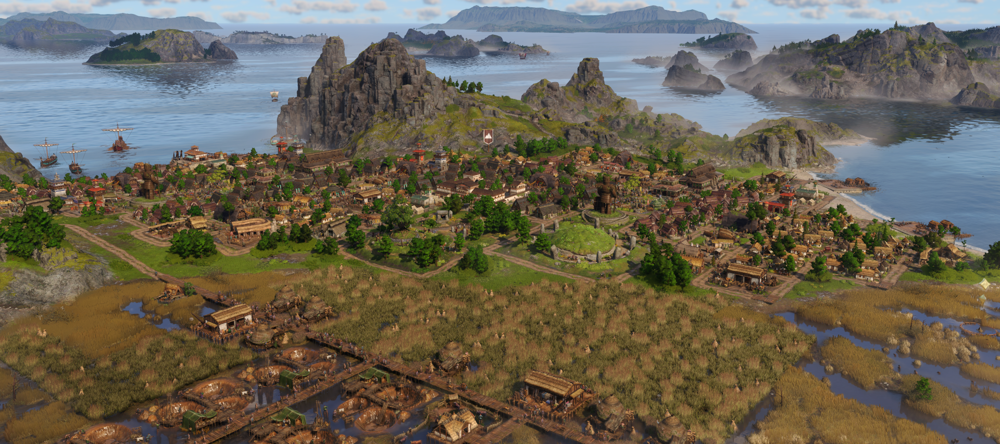

# Celtic Independence Overhaul

Welcome to the documentation for Celtic Independence Overhaul, a mod for Anno 117.

This mod provides alternative systems and buildings to remove the Roman-ness from Celtic islands in Albion and give them more unique feeling. It also changes the overall needs structure between Celts, Roman-Celts and Latium so that instead of the Celts and Roman-Celts both independently supplying Latium, the Celts supply the Roman-Celts, and the Roman-Celts supply Latium.

WARNING: Requires a new game. [See this page for more information.](new-game-requirement.md)

You can download the mod on mod.io here: [Celtic Independence Overhaul.](https://mod.io/g/anno-117-pax-romana/m/celtic-independence-overhaul)

To report bugs or give feedback you can either leave a comment on the mod.io page, or [open an issue on github.](https://github.com/jtmzac/Anno-117_Celtic-Independence-Overhaul/issues)

## Key Feature Overview
* Aqueducts are no longer useful on Celtic islands. They are replaced by new systems
* New public buildings to replace the Roman ones on Celtic islands
* Public buildings only affect matching residence type, with a new Roman-Celtic residence to enable this for waders
* Albion needs are a lot more self-sufficient. Importing from Latium is only needed for olive oil/garum and optionally for wine
* New needs for Celts: wicker baskets and ornamented ponies
* Celts now make and consume bread, Roman-Celts now consume and can make beer
* Chariots now made by nobles. Iron has been added to chariots and ceremonial shields
* Latium residences now consume sausages and wigs instead of cheese and cloaks

## Detailed Feature List
* Celtic mines (and the granite quarry) are now boosted by mealhouses, which are supplied by Celtic meals made from cheese, beer and beef roasts
* Celtic farms are now boosted by fertiliser silos, which are unlocked at 4k Epona devotion along with fertiliser
* Ceres extra fields buff no longer applies to Celtic farms/plantations. Fertiliser boosts productivity by 100% instead.
* Ochs farms output fertiliser as an additional good, but it can also be produced directly by fertiliser pits in marshes. These also take effect/are unlocked at 4k Epona devotion
* Farms and mines that are used by both Celts and Roman-Celts (iron/hemp/grapes) now have 2 versions so you can match the boost system to the island type
* The very Roman theatre and gambling house have been replaced with Celtic alternatives, the wickerman and the sacred tree
* Public buildings now only affect Celtic or Roman-Celtic houses of the matching type. Public building stats have been combined to account for this
* To allow the above for waders, a new Roman-Celtic wader residence has been added. They are mostly the same but use the tavern instead of the bardic hall
* The lock on upgrading to the other type of residence has been removed and each wader residence type only has a single upgrade path
* The Latium market has been added. You can use either it or the existing Celtic version to supply the market need. They had to be split into separate buildings because the Albion market is rotated 90 degrees from the Latium one, which means it doesn't work as a skin
* The Fanum is now a Celtic public building and Roman-Celts have the Sanctuary instead. This helps fix the weird layout mismatch since the Fanum is the same size as the other Celtic public buildings but not the Roman-Celtic ones
* Celts now need and can make bread, but instead of wheat they have rye farms. To support this, wheat has been changed to grain and the rye farm also outputs grain. This way rye can also be used in animal farm silos
* Roman-Celts now need and can make beer, but less efficiently from grain (wheat)
* Celts can now also make wine but with less efficiency at the final vintner stage
* Ceremonial shields have been moved to tier 3 to replace fine glassware and are now made from iron, wood and dye. Smiths/aldermen now consume wicker baskets in place of ceremonial shields. These are made from reeds and dye
* Chariots are now produced and consumed by Nobles and are made from wood, iron and horses. They replace fine glassware
* Instead of chariots, aldermen now produce and consume ornamented ponies made from bronze and ponies
* Roman-Celts now consume torcs instead of soap and cloaks instead of togas
* Equites and patricians now consume sausages instead of cheese and wigs instead of cloaks. Consumption rate has been changed based on difference in production time
* The herb fertility has been removed to support sausages being used in Latium instead of cheese. A beneficial side effect of this is that every island in Albion now has barley, which should help with the increased beer demand.
* Animal and fertiliser silos can now have their variation manually controlled, and there is two new animal silo variations with a muddy Albion ground texture.
* Paved roads can now also be unlocked and built with granite instead of concrete
* Albion shrines are now built with tiles instead of concrete

## Work in Progress Features
* I may tweak the graphics for some things a bit more in future but no promises. I need a break from Anno for now.
* The balancing is likely to have issues as you get to end-game. [See here for more details](need-changes.md#the-downside)

