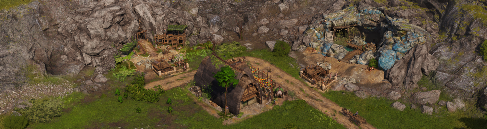

# The Mealhouse

The mealhouse, celtic meal kitchen, and celtic meals serve as an aqueduct productivity boost replacement for Celtic mines and the granite quarry.

Placing a mealhouse in street range of a valid tin, copper, Celtic iron or granite mine/quarry and supplying it with Celtic meals will apply the same 50% productivity buff as an aqueduct. Due to the significant extra costs and logistic requirements compared to something as simple as supplying grain to silos, Celtic meals are consumed at half the rate of silo inputs (one per 10 minutes instead of one per 5 minutes).

Celtic meals are created in the Celtic meal kitchen by combining cheese, beer and roast beef.

These buildings are all found in the aldermen construction menu and are unlocked by the same research node as aqueduct support for mines.