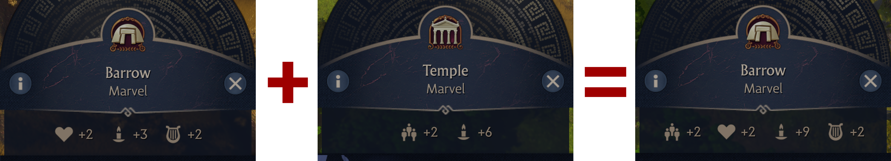
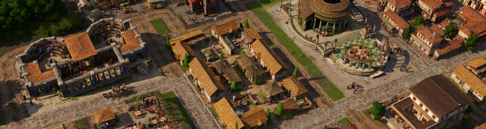
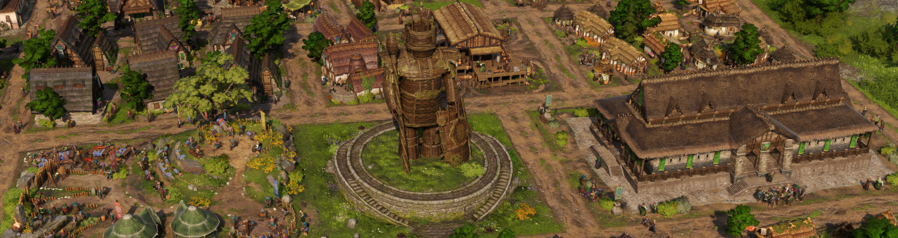
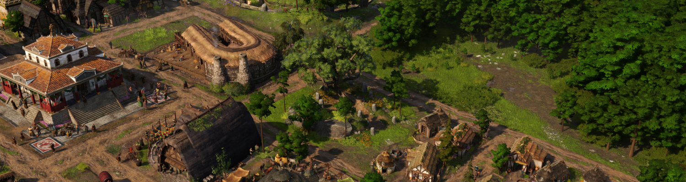

# Public Service Buildings
The Roman public service buildings were not far behind aqueducts on the list of things that needed to be removed/changed to make islands feel more Celtic. Fixing this requires two changes.

## Public Service Buildings now only Affect the Matching Type of Residence
In the base game at the time of writing (I suspect it may get changed), public service buildings in Albion affect both types of residences if the residence is at least one tier below the public service building. For example, the Roman baths affect waders and smiths but not aldermen, and the grammaticus affects waders but not smiths and aldermen. This is both unnecessarily confusing and heavily encourages using the temple and baths on Celtic islands for the wader and smith population boost.

To fix this, public service buildings no longer affect the non-matching type of residence, but the buffs have been merged to compensate. This means a sacred grove and barrow now provide the same total buffs as a sacred grove, barrow, temple and baths. The buffs have been combined for all the tier 2 and 3 buildings mostly in the matching pairings. The exception is that the alder council buffs were added to the theatre instead of the aqueduct cistern. Aqueduct cisterns are often placed in many places outside residential areas and having a population buff on them would have been too strong.

The obvious problem with doing this is that waders still benefit from both types, which is why it was necessary to add the new Roman-Celtic wader residence. This allows splitting the public service building effects correctly and also helps with the visual mismatch between celtic wader residences and the Roman mercator/nobles residence style.

## Replacing the Roman Public Buildings on Celtic Islands
The other required change was to replace the theatre and gambling house on Celtic islands. These two buildings are large and very Roman, and heavily contribute to giving Celtic islands a Roman "skyline".

### The Wickerman

The new wickerman public service building replaces the theatre for Celts and is a scaled up version of the smaller ornament available in the game. Its size is designed to match the fanum, recreation ground and alder council so you can neatly do a column of the wider public service buildings on your Celtic islands.

### The Sacred Tree

The new sacred tree public service building replaces the gambling house for the Celts and is based on the tree you have the option of cutting down in the campaign. As a 6x6 building it's the same size as a warehouse and you can conveniently replace any 2x2 block of houses with it later in the game when you unlock it via research.

### Why is the Fanum Celtic?
While the Fanum is a hybrid building it does lean more towards Roman, so you may be confused as to why it's now only a Celtic building. The answer is it's size. Resizing buildings is not that easy and breaks all the animations, so I wanted to avoid it wherever possible. Because the fanum perfectly matches the size of the recreation ground and alder council it was easiest to make it Celtic and find another building for the Roman-Celtic equivalent.

### Replacement Roman-Celtic Buildings: The Sanctuary and Tavern
With the fanum allocated to the Celts, there was a good excuse to move the Latium sanctuary over to the Roman-Celts. It might be less interesting but the fanum size is horrible for the Roman-Celts because it doesn't match anything else. The sanctuary by comparison matches the grammaticus, market and tavern size nicely, just like in Latium.

Finally, to clean up the last mismatching city building for the Roman-Celts the Latium tavern has been added for the Roman-Celtic waders. This fixes the other awkward build size issue with the Roman-Celts from the narrow bardic hall.